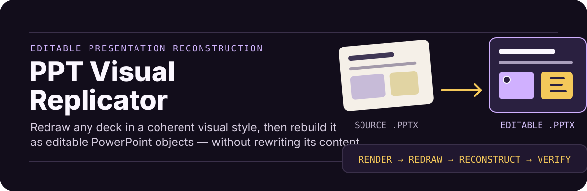
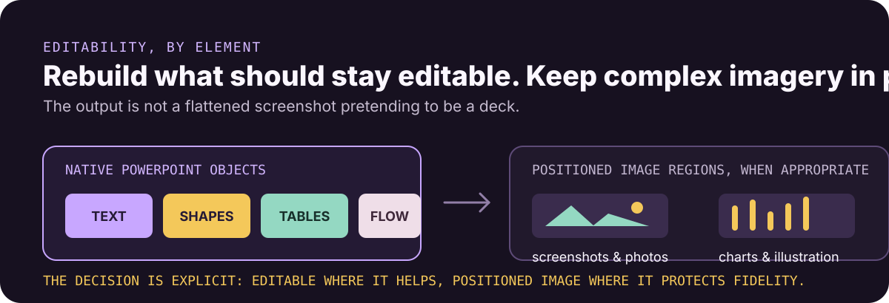
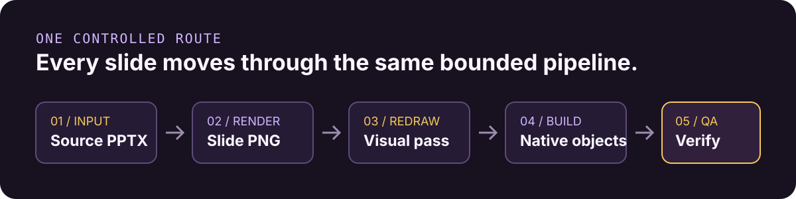

# PPT Visual Replicator

<p align="center">
  
</p>

[简体中文](README.zh-CN.md)

An agent skill that redraws PowerPoint slides in a coherent visual style and rebuilds them as an editable `.pptx` without rewriting the original content.

## Preserve the message. Upgrade the visual system.

Give it a `.pptx`, optionally a style brief or a small set of reference images, and get an editable deck back. The workflow protects number-sensitive native text, reuses deck-level assets, and keeps native PowerPoint objects whenever they are the right representation.

## What it preserves and rebuilds

- Accepts a `.pptx` as the only required input and renders its slides to PNG automatically.
- Supports an optional style brief or a small shared set of reference images.
- Uses visual OCR by default, with strict native-text protection for number-sensitive decks.
- Rebuilds titles, body text, cards, tables, arrows, and structural elements as editable PowerPoint objects.
- Preserves screenshots, photos, charts, and complex illustrations as positioned image regions when appropriate.
- Reuses deck-level assets and supports resumable runs.
- Seeds text, shapes, coordinates, and pictures directly from an editable source PPTX, avoiding a second image-model call during reconstruction.
- Bundles the `editppt` reconstruction runtime.

<p align="center">
  
</p>

## One controlled workflow

Every page follows the same pipeline: render the original page, redraw it with built-in imagegen, review `generated.png`, and reconstruct it as editable PowerPoint objects. There are no speed profiles or page-family routes.

<p align="center">
  
</p>

Reconstruction builds the native seed immediately, allows at most two preview-correction iterations, and records a concrete failure instead of leaving a page running indefinitely. Final QA uses macOS Quick Look when available, with LibreOffice as the fallback.

## Install the skill

Install globally with the Skills CLI:

```bash
npx skills add HiHeiBai/ppt-visual-replicator \
  --skill ppt-visual-replicator --global --yes
```

Or clone and copy the skill manually:

```bash
git clone https://github.com/HiHeiBai/ppt-visual-replicator.git
mkdir -p ~/.codex/skills
cp -R ppt-visual-replicator/skills/ppt-visual-replicator ~/.codex/skills/
```

Start a new Codex task after installation so the skill catalog refreshes.

## What you need

- Python 3.10+
- LibreOffice (`soffice` or `libreoffice`)
- Poppler (`pdftoppm`)
- A Codex environment with built-in image generation and an image backend available to `editppt`

macOS:

```bash
brew install --cask libreoffice
brew install poppler
```

Ubuntu/Debian:

```bash
sudo apt-get install libreoffice poppler-utils
```

The bundled editable-PPT runtime is installed automatically when first needed.

## Use it in Codex

In Codex, attach or point to a PowerPoint file and ask:

```text
Use $ppt-visual-replicator to redraw this PPTX and return an editable PPTX.
```

Optional inputs include:

- A target slide number for a one-page run
- A style brief
- One or a few deck-level reference-style PNGs
- Strict native-text protection

## Detailed workflow

```text
PPTX -> rendered source PNGs -> generation plan
     -> built-in imagegen redraw for every page -> native editable seed
     -> bounded editable reconstruction
     -> validation -> final real-render QA -> editable PPTX
```

Repeated logos, mascots, decorative elements, and recurring chrome can be stored in a shared deck asset index and reused during editable reconstruction.

## Development and validation

Run the test suite:

```bash
python3 -m unittest discover -s tests
```

Validate the skill package with the `quick_validate.py` script from OpenAI's `skill-creator` skill when available.

## License

[MIT](LICENSE)
